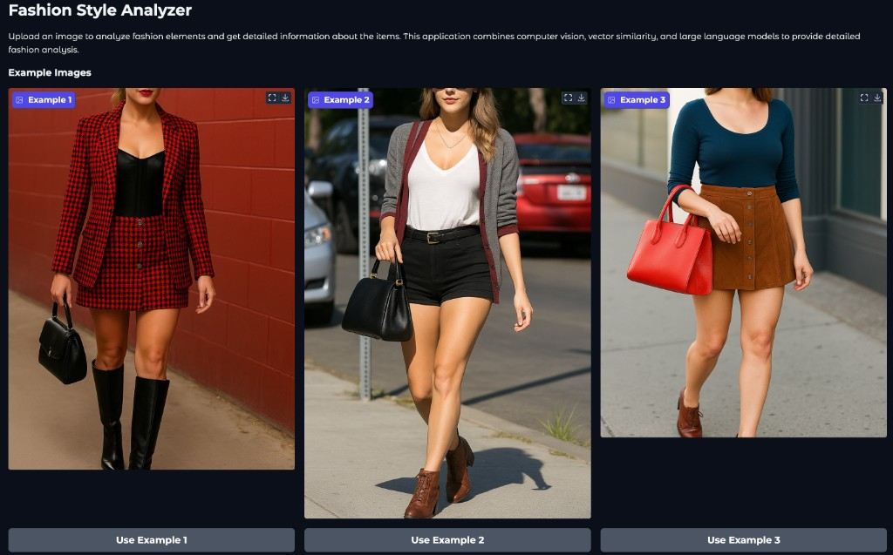
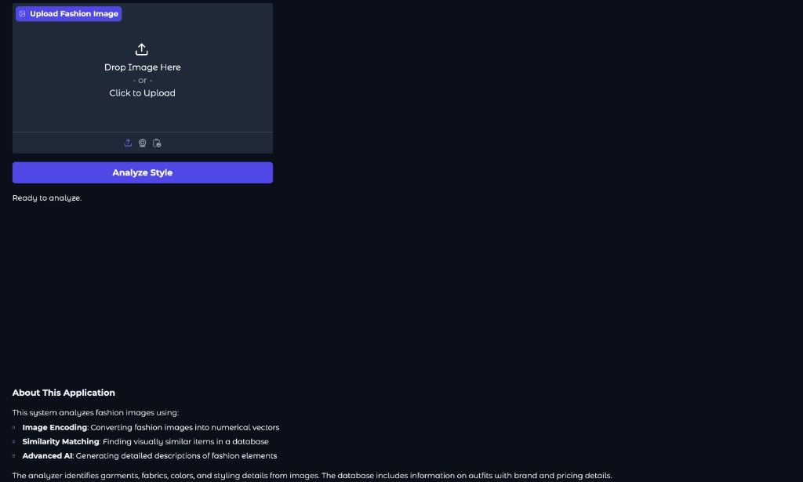
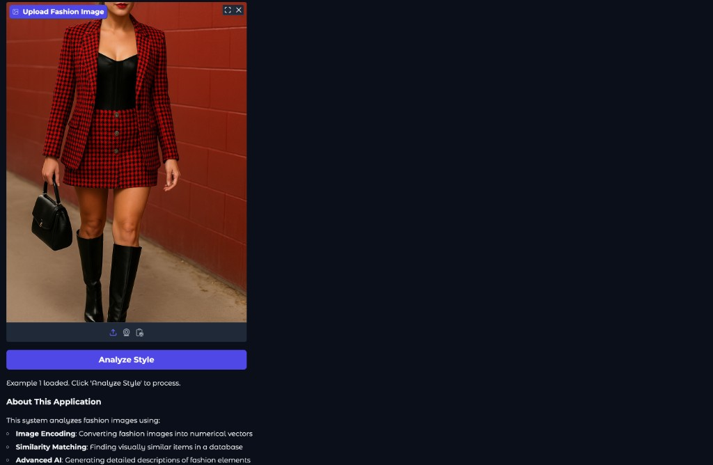
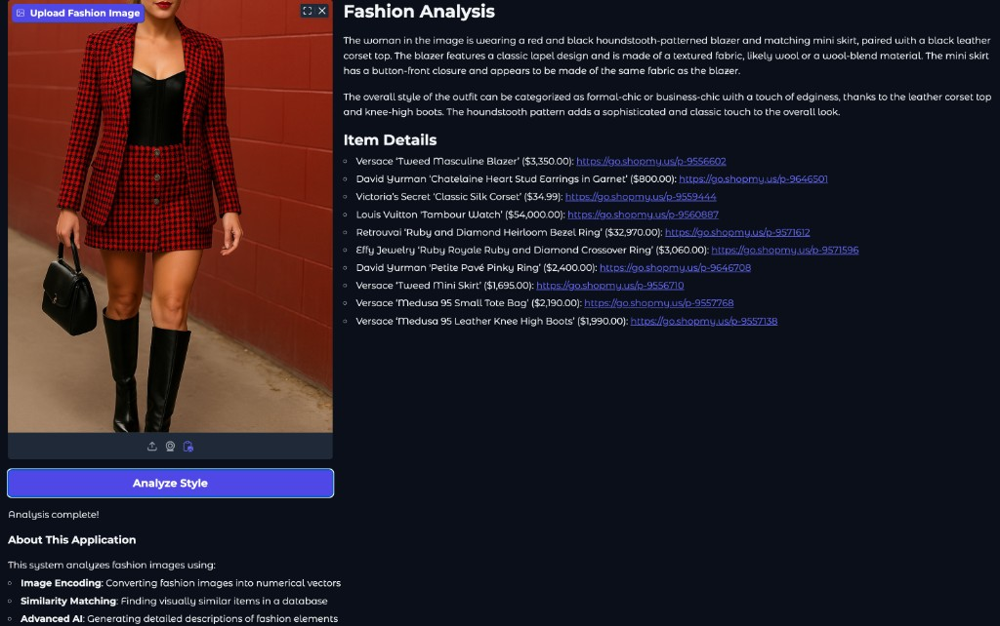
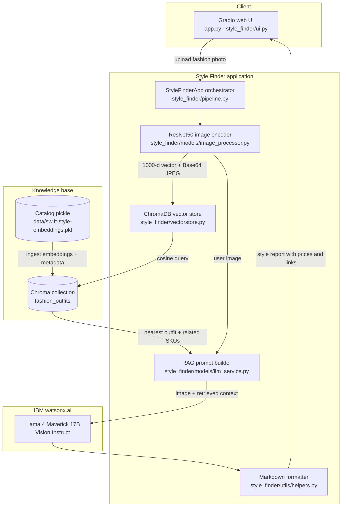
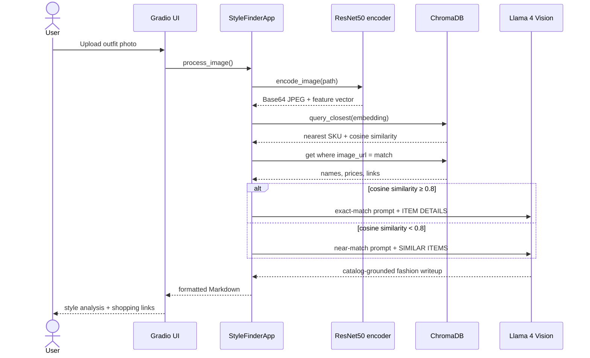
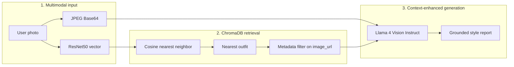
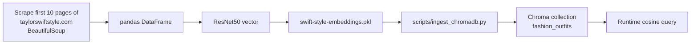

# Multimodal Style Finder

A production-oriented **multimodal RAG** system that turns a fashion photo into a catalog-grounded style report.

Upload an outfit image. The app encodes it with **ResNet50**, retrieves the nearest look from a **ChromaDB** vector catalog (item names, prices, purchase links), then asks **Llama 4 Maverick 17B Vision Instruct** on IBM watsonx.ai to write the analysis. Generation is never image-only: retrieved SKUs are injected into the prompt so the writeup stays specific and shoppable.

| Encode | Retrieve | Generate |
| --- | --- | --- |
| ResNet50 visual embedding + JPEG Base64 | ChromaDB cosine nearest-neighbor search | Llama 4 Vision Instruct with catalog context |

---

## Demo

The Gradio app lets you pick a sample look or upload your own photo, then returns a style writeup plus shoppable item details.

> **Sample images are Taylor Swift outfits**, scraped from the first 10 pages of [taylorswiftstyle.com](https://taylorswiftstyle.com) with BeautifulSoup. They are **not** stock photos of a hired fashion model. The person in the demo screenshots and `examples/` files is Taylor Swift wearing documented looks from that site.

**1. Example gallery** — choose one of the built-in Taylor Swift outfit photos.



**2. Upload** — drop a fashion image or click to browse.



**3. Example loaded** — a selected Taylor Swift look is ready for analysis.



**4. Analysis results** — multimodal RAG returns a grounded writeup and catalog SKUs.



---

## Architecture

The system is a classic RAG loop with a vision front door: **image in → ChromaDB vector search → context-augmented generation**.



### Multimodal RAG pipeline

Foundation models do not contain this catalog. Retrieval-Augmented Generation merges **your** outfit data with the model's visual understanding so answers include real item names, prices, and buy links instead of a generic caption.



### What each RAG stage does



Exact matches (score ≥ `SIMILARITY_THRESHOLD`, default **0.8**) ask the model to include **Item Details**. Near matches are labeled **Similar Items** so the UI does not oversell a weak retrieval.

---

## Project structure

```text
Multimodal-Style-Finder/
├── app.py                      # CLI / Gradio entry point
├── pyproject.toml
├── requirements.txt
├── .env.example
├── style_finder/
│   ├── config.py               # env-driven settings
│   ├── catalog.py              # pickle load + schema validation
│   ├── ingest.py               # pickle → Chroma upsert
│   ├── vectorstore.py          # ChromaDB collection wrapper
│   ├── pipeline.py             # encode → retrieve → generate
│   ├── ui.py                   # Gradio layout
│   ├── models/
│   │   ├── image_processor.py  # ResNet50 encoder
│   │   ├── retriever.py        # retrieval errors
│   │   ├── prompts.py          # RAG prompt templates
│   │   └── llm_service.py      # Llama 4 Vision client
│   └── utils/helpers.py
├── data/                       # pickle + chroma index (gitignored)
├── examples/                   # Taylor Swift outfits from taylorswiftstyle.com
├── docs/screenshots/           # README demo captures
├── scripts/
│   ├── download_dataset.sh
│   └── ingest_chromadb.py
└── tests/
```

| Path | Role |
| --- | --- |
| `style_finder/pipeline.py` | Runs the full RAG loop for one upload |
| `style_finder/vectorstore.py` | Persistent ChromaDB index, query, and SKU grouping |
| `style_finder/ingest.py` | Seeds Chroma from the catalog pickle |
| `style_finder/catalog.py` | Loads the pickle and checks required columns |
| `style_finder/models/image_processor.py` | Encodes photos to vectors and JPEG Base64 |
| `style_finder/models/prompts.py` | Exact-match vs similar-item RAG prompts |
| `style_finder/models/llm_service.py` | Calls Llama 4 Vision on watsonx |
| `data/chroma/` | On-disk Chroma collection (`fashion_outfits`) |

---

## Dataset and Chroma index

The demo catalog and sample images are **Taylor Swift outfits** from [taylorswiftstyle.com](https://taylorswiftstyle.com), not photos of a generic lady model. The first **10 pages** of the site were scraped with **BeautifulSoup**, collecting outfit photos of Taylor Swift plus each item's name, price, and purchase link.

Each catalog row is one fashion item: **name**, **price**, **purchase link**, and the **full-outfit image** (Taylor Swift wearing that look). Embeddings are ingested once into Chroma so request-time retrieval is a vector query, not a full pandas scan.



Required pickle columns: `Embedding`, `Image URL`, `Item Name`, `Price`, `Link`.

Chroma metadata per SKU: `item_name`, `price`, `link`, `image_url`. The collection uses **cosine** space (`hnsw:space=cosine`). Similarity is `1 - chroma_distance`.

```bash
bash scripts/download_dataset.sh
python scripts/ingest_chromadb.py
```

If the collection is empty at startup, the app ingests automatically from `DATASET_PATH`. Use `--force-ingest` (or `python scripts/ingest_chromadb.py --force`) to rebuild.

Runtime encoding uses the same ResNet50 ImageNet weights and 224×224 ImageNet normalization so query vectors stay in the same space as the index.

---

## Quick start

**Requirements:** Python 3.10+, an [IBM watsonx.ai](https://www.ibm.com/products/watsonx-ai) project, and a model that accepts image chat (default: Llama 4 Maverick Vision Instruct).

```bash
cd Multimodal-Style-Finder
python3 -m venv .venv
source .venv/bin/activate
pip install -r requirements-dev.txt

cp .env.example .env
# set WATSONX_APIKEY and WATSONX_PROJECT_ID in .env

bash scripts/download_dataset.sh
python scripts/ingest_chromadb.py
python app.py
```

Open [http://127.0.0.1:5000](http://127.0.0.1:5000). Use **Example 1–3** or upload your own photo, then click **Analyze Style**.

```bash
python app.py --host 0.0.0.0 --port 7860
python app.py --chroma-path data/chroma --force-ingest
```

`--share` is **off** by default. Only enable it when you intentionally want a public Gradio tunnel.

---

## Configuration

Copy `.env.example` to `.env`. Secrets stay out of source.

| Variable | Purpose | Default |
| --- | --- | --- |
| `WATSONX_APIKEY` | IBM watsonx API key | *(required)* |
| `WATSONX_PROJECT_ID` | watsonx project | `skills-network` |
| `WATSONX_REGION` | Regional endpoint | `us-south` |
| `LLAMA_MODEL_ID` | Vision-language model | `meta-llama/llama-4-maverick-17b-128e-instruct-fp8` |
| `DATASET_PATH` | Catalog pickle used to seed Chroma | `data/swift-style-embeddings.pkl` |
| `CHROMA_PATH` | Persistent Chroma directory | `data/chroma` |
| `CHROMA_COLLECTION` | Collection name | `fashion_outfits` |
| `SIMILARITY_THRESHOLD` | Exact vs similar match | `0.8` |
| `SERVER_NAME` / `SERVER_PORT` | Gradio bind address | `127.0.0.1` / `5000` |
| `GRADIO_SHARE` | Public share link | `false` |
| `LOG_LEVEL` | Logging verbosity | `INFO` |

---

## How a request is processed

1. **Ingest** — a PIL upload is saved as a temporary JPEG (or a local example path is used as-is).
2. **Encode** — ResNet50 produces a flattened feature vector; the same image is Base64-encoded for the VLM.
3. **Retrieve** — ChromaDB returns the nearest SKU in cosine space.
4. **Expand** — every SKU that shares the matched `image_url` is loaded from Chroma metadata (one photo → many items).
5. **Generate** — Llama 4 Vision receives the user photo plus the retrieved list. If the model omits `ITEM DETAILS` / `SIMILAR ITEMS`, the catalog list is appended so shopping data is never dropped.
6. **Present** — dollar signs are escaped, headings are normalized, and the Gradio panel renders Markdown.

---

## Tech stack

- **Vision encoder:** torchvision ResNet50 (`IMAGENET1K_V1`)
- **Vector database:** ChromaDB persistent client, cosine HNSW
- **Generator:** IBM watsonx.ai `ModelInference` chat with image content parts
- **UI:** Gradio 5 Blocks
- **Config:** `python-dotenv` + frozen `Settings` dataclass

---

## Tests

Unit tests cover catalog grouping, Markdown cleanup, Chroma upsert/query (including dropped NaN embeddings), prompt fallbacks, and dataset schema checks. They use an ephemeral Chroma client and do not call watsonx or download ResNet weights.

```bash
pip install -r requirements-dev.txt
pytest
```

---

## Operations notes

- Bind to `127.0.0.1` unless the app is behind a reverse proxy. Use `--host 0.0.0.0` only on a trusted network.
- The catalog pickle and Chroma index stay out of git. Fetch the pickle, then ingest.
- If analysis fails with a missing-key error, confirm `.env` has `WATSONX_APIKEY` and that the project id can access the Llama 4 Vision model.
- Encoder and index must stay in sync. Changing pooling (for example, using the 2048-d avgpool layer) requires rebuilding the pickle **and** re-ingesting Chroma with `--force`.

More background: [docs/multimodal-rag.md](docs/multimodal-rag.md) and [docs/dataset.md](docs/dataset.md).
